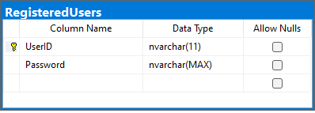
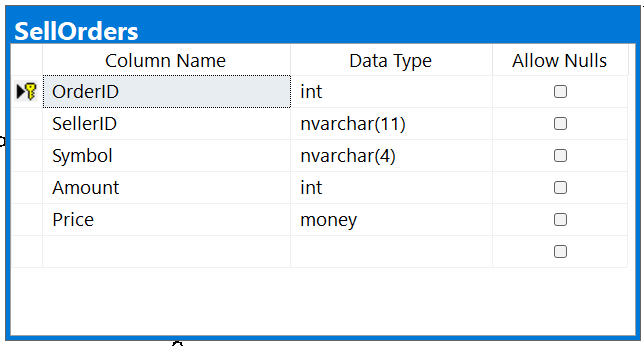
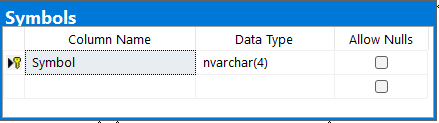
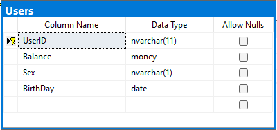

# Podstawowe założenia projektu:
* Celem projektu jest stworzenie bazy danych dla giełdy, która umożliwi łatwe i efektywne zarządzanie transakcjami kupna i sprzedaży akcji, a także śledzenie aktualnych notowań.
* Ogólne założenia projektu:
  - Handel akcjami
  - Zarządzanie użytkownikami
  - Przegląd historycznych danych
* Możliwości projektu:
  - Kupno i sprzedaż akcji
  - Rejestracja i usuwanie użytkowników
  - Przegląd historii notowań wybranej akcji 
  - Przegląd notowań giełdy z konkretnego dnia
* Ograniczenia projektu:
  - Brak synchronizacji z rzeczywistą giełdą.
  - Pominięcie wartości Open i Close

# Diagram ER:

# Schemat baz danych:

# Funkcje:
* Pierwsza funkcja nazywa się HasEnoughMoney i przyjmuje jako parametry wejściowe ID użytkownika i kwotę pieniędzy. Zwraca wartość bitową wskazującą, czy użytkownik ma wystarczająco dużo pieniędzy na swoim koncie, aby dokonać transakcji w określonej kwocie. Funkcja najpierw sprawdza saldo użytkownika w stosunku do żądanej kwoty i zwraca 1, jeśli saldo jest większe lub równe żądanej kwocie; w przeciwnym razie zwraca 0.
* Druga funkcja nazywa się HasEnoughStockActions i przyjmuje jako parametry wejściowe ID użytkownika, symbol akcji i kwotę. Zwraca wartość bitową wskazującą, czy użytkownik ma wystarczającą ilość udziałów w określonej akcji, aby dokonać transakcji w określonej kwocie. Funkcja najpierw sprawdza, czy użytkownik ma jakieś udziały w określonej akcji, zwracając 0, jeśli ich nie ma. Jeśli użytkownik ma udziały, funkcja sprawdza, czy ilość udziałów, które posiada, jest większa lub równa żądanej kwocie, a następnie zwraca 1, jeśli jest; w przeciwnym razie zwraca 0.
* Trzecia funkcja nazywa się GetSpecificUserStocks i przyjmuje jako parametr wejściowy ID użytkownika. Zwraca tabelę zawierającą wszystkie akcje posiadane przez użytkownika o określonym ID.
* Czwarta funkcja nazywa się GetStockMarketInSpecificDate i przyjmuje jako parametr wejściowy datę. Zwraca tabelę zawierającą ceny zamknięcia wszystkich akcji notowanych w określonym dniu.
* Piąta funkcja nazywa się GetSpecificStockHistory i przyjmuje jako parametr wejściowy symbol akcji. Zwraca tabelę zawierającą codzienne ceny zamknięcia określonej akcji we wszystkich dniach handlowych.
* Szósta funkcja nazywa się HasUser i przyjmuje jako parametr wejściowy ID użytkownika. Zwraca wartość bitową wskazującą, czy użytkownik o określonym ID istnieje w systemie.
* Siódma funkcja nazywa się CheckPesel i przyjmuje jako parametr wejściowy numer PESEL (unikalny numer identyfikacyjny używany w Polsce). Zwraca wartość bitową wskazującą, czy numer jest poprawny zgodnie z algorytmem sumy kontrolnej PESEL. Funkcja najpierw oblicza sum
* Ósma funkcja nazywa się CheckPassword i służy do weryfikacji siły hasła. Przyjmuje jako parametr wejściowy tekst hasła w postaci napisu nvarchar(MAX). Funkcja zwraca wartość bitową - 1, jeśli hasło spełnia wymagania co do siły, oraz 0 w przeciwnym przypadku. W celu określenia, czy hasło jest wystarczająco silne, funkcja sprawdza, czy zawiera co najmniej jedną cyfrę, jedną wielką literę, jedną małą literę oraz jedną znak specjalny z zestawu !@#$%a^&*()-_+=.,;:"~`. Ponadto, sprawdzane jest również, czy długość hasła wynosi co najmniej 8 znaków.
* Dziewiąta funkcja nazywa się ReadSex i służy do odczytu płci osoby o danym numerze PESEL. Funkcja przyjmuje jako parametr wejściowy numer PESEL w postaci napisu nvarchar(11). Zwraca wartość napisu nvarchar(1) - 'M' dla mężczyzn i 'W' dla kobiet. Do określenia płci funkcja korzysta z jednej z cyfr numeru PESEL, która określa płeć: 0, 2, 4, 6, 8 - kobieta, 1, 3, 5, 7, 9 - mężczyzna. Funkcja sprawdza tę cyfrę, a następnie zwraca odpowiedni znak.
* Dziesiąta funkcja nazywa się ReadBirthDay i służy do odczytu daty urodzenia osoby o danym numerze PESEL. Funkcja przyjmuje jako parametr wejściowy numer PESEL w postaci napisu nvarchar(11). Zwraca wartość typu date, reprezentującą datę urodzenia osoby. Do odczytu daty urodzenia funkcja korzysta z trzech kolejnych cyfr numeru PESEL, które określają kolejno rok, miesiąc i dzień urodzenia. Pierwsze dwie cyfry określają dekadę roku urodzenia, a ostatnia cyfra roku w dekadzie. W przypadku osób urodzonych po 2000 roku pierwsze dwie cyfry oznaczają rok od 2000, a nie od 1900. Funkcja parsuje te trzy cyfry, a następnie korzystając z funkcji DATEFROMPARTS, tworzy i zwraca datę urodzenia.

# Procedury:
* Pierwsza procedura AddStocksToUser - procedura ta przyjmuje trzy parametry: userID, symbol oraz amount. Jeśli użytkownik o podanym userID nie posiada jeszcze akcji o danym symbolu, to procedura dokonuje dodania nowego wiersza do tabeli UserStocks z wartościami przekazanymi w parametrach. W przeciwnym przypadku, procedura aktualizuje istniejący wiersz w tabeli UserStocks, dodając wartość przekazaną jako amount do pola Amount w wierszu zgodnym z podanymi wartościami userID i symbol.
* Druga procedura RemoveStocksFromUser - procedura ta przyjmuje trzy parametry: userID, symbol oraz amount. Jeśli użytkownik o podanym userID posiada akcje o danym symbolu w ilości większej lub równej od wartości przekazanej jako amount, to procedura dokonuje aktualizacji wiersza w tabeli UserStocks, odejmując wartość przekazaną jako amount od pola Amount w wierszu zgodnym z podanymi wartościami userID i symbol. W przeciwnym przypadku, procedura wypisuje komunikat informujący, że użytkownik nie posiada wystarczającej ilości akcji do wykonania operacji.
* Trzecia procedura Buy - procedura ta przyjmuje cztery parametry: buyerID, symbol, amount oraz maxPrice. Procedura ta sprawdza, czy użytkownik o podanym buyerID ma wystarczającą ilość pieniędzy na koncie, aby dokonać zakupu akcji o podanym symbolu w ilości przekazanej jako amount po maksymalnej cenie przekazanej jako maxPrice. Jeśli tak, to procedura aktualizuje pole Balance w tabeli Users, odejmując od niego iloczyn amount i maxPrice. Następnie, procedura pobiera z bazy danych wszystkie wiersze z tabeli SellOrders, które spełniają określone kryteria (symbol = podany symbol i cena <= podana maksymalna cena), sortując je w kolejności malejącej po cenie. Następnie procedura uruchamia pętlę, w której dla każdego wiersza z wyniku zapytania wykonywane są odpowiednie operacje w celu dokonania transakcji kupna. Jeśli po przejściu przez całą listę SellOrders użytkownik wciąż nie dokonał pełnej transakcji, to procedura dodaje wiersz do tabeli BuyOrders z wartościami przekazanymi w parametrach.
* Czwarta procedura Sell - procedura ta przyjmuje cztery parametry: sellerID, symbol, amount oraz sellPrice. Procedura ta sprawdza, czy użytkownik o podanym sellerID ma wystarczającą ilość akcji o podanym symbolu na koncie, aby dokonać sprzedaży ich w ilości przekazanej jako amount po cenie przekazanej jako sellPrice.
* Piąta procedura DepositMoney - procedura ta przyjmuje dwa parametry wejściowe: userID oraz money, reprezentujące odpowiednio identyfikator użytkownika i kwotę pieniędzy, którą użytkownik chce wpłacić na swoje konto. Procedura sprawdza, czy użytkownik o podanym identyfikatorze istnieje w bazie danych (wywołując funkcję HasUser), a następnie aktualizuje wartość pola Balance w tabeli Users dla danego użytkownika, dodając do niej kwotę money.
* Szósta procedura RegisterUser - procedura ta przyjmuje dwa parametry wejściowe: pesel oraz password, reprezentujące odpowiednio numer PESEL i hasło nowo rejestrującego się użytkownika. Procedura najpierw wywołuje funkcje CheckPesel oraz CheckPassword, aby sprawdzić poprawność podanych danych. Jeśli dane są poprawne, procedura wprowadza nowego użytkownika do tabeli Users, uzupełniając pola UserID, Balance, Sex i BirthDay na podstawie numeru PESEL oraz dodaje wpis do tabeli RegisteredUsers, zawierający dane o nowym użytkowniku i jego haśle.
* Siódma procedura DeleteUser - procedura ta przyjmuje jeden parametr wejściowy: pesel, reprezentujący numer PESEL użytkownika, którego konto ma zostać usunięte. Procedura wywołuje funkcję HasUser, aby sprawdzić, czy użytkownik o podanym numerze PESEL istnieje w bazie danych. Jeśli tak, procedura usuwa wpis o tym użytkowniku z tabeli RegisteredUsers. W przeciwnym wypadku procedura zwraca informację o błędzie.

# Triggery:
* Pierwszy trigger ReturnRestFromDepositedMoney - trigger odpowiadający za zwrot reszty pieniędzy po transakcji kupna akcji. Po dokonaniu transakcji i zapisaniu jej w tabeli TransactionsHistory, procedura ta oblicza, ile pieniędzy należy zwrócić kupującemu, i aktualizuje jego saldo w tabeli Users.
* Drugi trigger TransferSaleMoney - trigger odpowiedzialny za przetransferowanie pieniędzy po transakcji sprzedaży akcji. Po dokonaniu transakcji i zapisaniu jej w tabeli TransactionsHistory, procedura ta oblicza, ile pieniędzy należy przesłać sprzedającemu, i aktualizuje jego saldo w tabeli Users.
* Trzeci trigger UpdateStockHistory - trigger, który aktualizuje historię notowań akcji w tabeli StockHistory. Po dokonaniu transakcji i zapisaniu jej w tabeli TransactionsHistory, procedura ta sprawdza, czy w tabeli StockHistory istnieje już wpis dla danej daty i symbolu akcji. Jeśli tak, to aktualizuje wartości najniższego i najwyższego notowania, jeśli cena transakcji jest odpowiednio mniejsza lub większa od poprzednich wartości. Jeśli wpis dla danej daty i symbolu nie istnieje, to zostaje utworzony nowy wpis z aktualną ceną notowania.
* Czwarty trigger "TransferSymbols" - po wstawieniu nowego wiersza do tabeli TransactionsHistory, trigger ten jest wyzwalany i pobiera informacje o kupującym (BuyerID), symbolu akcji (Symbol) oraz ilości zakupionych akcji (Amount) z tabeli "inserted". Następnie wywołuje procedurę "addStocksToUser" w celu dodania zakupionych akcji do konta kupującego.
* Piąty trigger "MigrateRegisteredUserToDeletedUser" - po usunięciu wiersza z tabeli RegisteredUsers, trigger ten jest wyzwalany i pobiera informacje o ID usuniętego użytkownika (UserID) z tabeli "deleted". Następnie wstawia te informacje do tabeli DeletedUsers razem z datą usunięcia.
* Szósty trigger "DeleteUserStock" - po aktualizacji wiersza w tabeli UserStocks, trigger ten jest wyzwalany i pobiera informacje o użytkowniku (UserID), symbolu akcji (Symbol) oraz ilości akcji (Amount) z tabeli "inserted". Jeśli ilość akcji wynosi zero, trigger usuwa wiersz z tabeli UserStocks.
* Siódmy trigger "DeleteEmptyBuyOrder" - po aktualizacji wiersza w tabeli BuyOrders, trigger ten jest wyzwalany i pobiera informacje o ID zamówienia kupna (OrderID) oraz ilości zamówionych akcji (Amount) z tabeli "inserted". Jeśli ilość zamówionych akcji wynosi zero, trigger usuwa wiersz z tabeli BuyOrders.
* Ósmy trigger "DeleteEmptySellOrder" - po aktualizacji wiersza w tabeli SellOrders, trigger ten jest wyzwalany i pobiera informacje o ID zamówienia sprzedaży (OrderID) oraz ilości zamówionych akcji (Amount) z tabeli "inserted". Jeśli ilość zamówionych akcji wynosi zero, trigger usuwa wiersz z tabeli SellOrders.