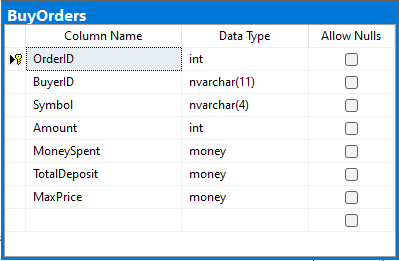
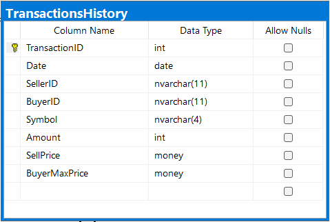

# Podstawowe założenia projektu:
* Celem projektu jest stworzenie bazy danych dla giełdy, która umożliwi łatwe i efektywne zarządzanie transakcjami kupna i sprzedaży akcji, a także śledzenie aktualnych notowań.
* Ogólne założenia projektu:
  - Handel akcjami
  - Zarządzanie użytkownikami
  - Przegląd historycznych danych
* Możliwości projektu:
  - Kupno i sprzedaż akcji
  - Rejestracja i usuwanie użytkowników
  - Przegląd historii notowań wybranej akcji 
  - Przegląd notowań giełdy z konkretnego dnia
* Ograniczenia projektu:
  - Brak synchronizacji z rzeczywistą giełdą.
  - Pominięcie wartości Open i Close

# Diagram ER:


# Schemat baz danych:






# Funkcje:
* Pierwsza funkcja nazywa się HasEnoughMoney i przyjmuje jako parametry wejściowe ID użytkownika i kwotę pieniędzy. Zwraca wartość bitową wskazującą, czy użytkownik ma wystarczająco dużo pieniędzy na swoim koncie, aby dokonać transakcji w określonej kwocie. Funkcja najpierw sprawdza saldo użytkownika w stosunku do żądanej kwoty i zwraca 1, jeśli saldo jest większe lub równe żądanej kwocie; w przeciwnym razie zwraca 0.
* Druga funkcja nazywa się HasEnoughStockActions i przyjmuje jako parametry wejściowe ID użytkownika, symbol akcji i kwotę. Zwraca wartość bitową wskazującą, czy użytkownik ma wystarczającą ilość udziałów w określonej akcji, aby dokonać transakcji w określonej kwocie. Funkcja najpierw sprawdza, czy użytkownik ma jakieś udziały w określonej akcji, zwracając 0, jeśli ich nie ma. Jeśli użytkownik ma udziały, funkcja sprawdza, czy ilość udziałów, które posiada, jest większa lub równa żądanej kwocie, a następnie zwraca 1, jeśli jest; w przeciwnym razie zwraca 0.
* Trzecia funkcja nazywa się GetSpecificUserStocks i przyjmuje jako parametr wejściowy ID użytkownika. Zwraca tabelę zawierającą wszystkie akcje posiadane przez użytkownika o określonym ID.
* Czwarta funkcja nazywa się GetStockMarketInSpecificDate i przyjmuje jako parametr wejściowy datę. Zwraca tabelę zawierającą ceny zamknięcia wszystkich akcji notowanych w określonym dniu.
* Piąta funkcja nazywa się GetSpecificStockHistory i przyjmuje jako parametr wejściowy symbol akcji. Zwraca tabelę zawierającą codzienne ceny zamknięcia określonej akcji we wszystkich dniach handlowych.
* Szósta funkcja nazywa się HasUser i przyjmuje jako parametr wejściowy ID użytkownika. Zwraca wartość bitową wskazującą, czy użytkownik o określonym ID istnieje w systemie.
* Siódma funkcja nazywa się CheckPesel i przyjmuje jako parametr wejściowy numer PESEL (unikalny numer identyfikacyjny używany w Polsce). Zwraca wartość bitową wskazującą, czy numer jest poprawny zgodnie z algorytmem sumy kontrolnej PESEL. Funkcja najpierw oblicza sum
* Ósma funkcja nazywa się CheckPassword i służy do weryfikacji siły hasła. Przyjmuje jako parametr wejściowy tekst hasła w postaci napisu nvarchar(MAX). Funkcja zwraca wartość bitową - 1, jeśli hasło spełnia wymagania co do siły, oraz 0 w przeciwnym przypadku. W celu określenia, czy hasło jest wystarczająco silne, funkcja sprawdza, czy zawiera co najmniej jedną cyfrę, jedną wielką literę, jedną małą literę oraz jedną znak specjalny z zestawu !@#$%a^&*()-_+=.,;:"~`. Ponadto, sprawdzane jest również, czy długość hasła wynosi co najmniej 8 znaków.
* Dziewiąta funkcja nazywa się ReadSex i służy do odczytu płci osoby o danym numerze PESEL. Funkcja przyjmuje jako parametr wejściowy numer PESEL w postaci napisu nvarchar(11). Zwraca wartość napisu nvarchar(1) - 'M' dla mężczyzn i 'W' dla kobiet. Do określenia płci funkcja korzysta z jednej z cyfr numeru PESEL, która określa płeć: 0, 2, 4, 6, 8 - kobieta, 1, 3, 5, 7, 9 - mężczyzna. Funkcja sprawdza tę cyfrę, a następnie zwraca odpowiedni znak.
* Dziesiąta funkcja nazywa się ReadBirthDay i służy do odczytu daty urodzenia osoby o danym numerze PESEL. Funkcja przyjmuje jako parametr wejściowy numer PESEL w postaci napisu nvarchar(11). Zwraca wartość typu date, reprezentującą datę urodzenia osoby. Do odczytu daty urodzenia funkcja korzysta z trzech kolejnych cyfr numeru PESEL, które określają kolejno rok, miesiąc i dzień urodzenia. Pierwsze dwie cyfry określają dekadę roku urodzenia, a ostatnia cyfra roku w dekadzie. W przypadku osób urodzonych po 2000 roku pierwsze dwie cyfry oznaczają rok od 2000, a nie od 1900. Funkcja parsuje te trzy cyfry, a następnie korzystając z funkcji DATEFROMPARTS, tworzy i zwraca datę urodzenia.

# Procedury:
* Pierwsza procedura AddStocksToUser - procedura ta przyjmuje trzy parametry: userID, symbol oraz amount. Jeśli użytkownik o podanym userID nie posiada jeszcze akcji o danym symbolu, to procedura dokonuje dodania nowego wiersza do tabeli UserStocks z wartościami przekazanymi w parametrach. W przeciwnym przypadku, procedura aktualizuje istniejący wiersz w tabeli UserStocks, dodając wartość przekazaną jako amount do pola Amount w wierszu zgodnym z podanymi wartościami userID i symbol.
* Druga procedura RemoveStocksFromUser - procedura ta przyjmuje trzy parametry: userID, symbol oraz amount. Jeśli użytkownik o podanym userID posiada akcje o danym symbolu w ilości większej lub równej od wartości przekazanej jako amount, to procedura dokonuje aktualizacji wiersza w tabeli UserStocks, odejmując wartość przekazaną jako amount od pola Amount w wierszu zgodnym z podanymi wartościami userID i symbol. W przeciwnym przypadku, procedura wypisuje komunikat informujący, że użytkownik nie posiada wystarczającej ilości akcji do wykonania operacji.
* Trzecia procedura Buy - procedura ta przyjmuje cztery parametry: buyerID, symbol, amount oraz maxPrice. Procedura ta sprawdza, czy użytkownik o podanym buyerID ma wystarczającą ilość pieniędzy na koncie, aby dokonać zakupu akcji o podanym symbolu w ilości przekazanej jako amount po maksymalnej cenie przekazanej jako maxPrice. Jeśli tak, to procedura aktualizuje pole Balance w tabeli Users, odejmując od niego iloczyn amount i maxPrice. Następnie, procedura pobiera z bazy danych wszystkie wiersze z tabeli SellOrders, które spełniają określone kryteria (symbol = podany symbol i cena <= podana maksymalna cena), sortując je w kolejności malejącej po cenie. Następnie procedura uruchamia pętlę, w której dla każdego wiersza z wyniku zapytania wykonywane są odpowiednie operacje w celu dokonania transakcji kupna. Jeśli po przejściu przez całą listę SellOrders użytkownik wciąż nie dokonał pełnej transakcji, to procedura dodaje wiersz do tabeli BuyOrders z wartościami przekazanymi w parametrach.
* Czwarta procedura Sell - procedura ta przyjmuje cztery parametry: sellerID, symbol, amount oraz sellPrice. Procedura ta sprawdza, czy użytkownik o podanym sellerID ma wystarczającą ilość akcji o podanym symbolu na koncie, aby dokonać sprzedaży ich w ilości przekazanej jako amount po cenie przekazanej jako sellPrice.
* Piąta procedura DepositMoney - procedura ta przyjmuje dwa parametry wejściowe: userID oraz money, reprezentujące odpowiednio identyfikator użytkownika i kwotę pieniędzy, którą użytkownik chce wpłacić na swoje konto. Procedura sprawdza, czy użytkownik o podanym identyfikatorze istnieje w bazie danych (wywołując funkcję HasUser), a następnie aktualizuje wartość pola Balance w tabeli Users dla danego użytkownika, dodając do niej kwotę money.
* Szósta procedura RegisterUser - procedura ta przyjmuje dwa parametry wejściowe: pesel oraz password, reprezentujące odpowiednio numer PESEL i hasło nowo rejestrującego się użytkownika. Procedura najpierw wywołuje funkcje CheckPesel oraz CheckPassword, aby sprawdzić poprawność podanych danych. Jeśli dane są poprawne, procedura wprowadza nowego użytkownika do tabeli Users, uzupełniając pola UserID, Balance, Sex i BirthDay na podstawie numeru PESEL oraz dodaje wpis do tabeli RegisteredUsers, zawierający dane o nowym użytkowniku i jego haśle.
* Siódma procedura DeleteUser - procedura ta przyjmuje jeden parametr wejściowy: pesel, reprezentujący numer PESEL użytkownika, którego konto ma zostać usunięte. Procedura wywołuje funkcję HasUser, aby sprawdzić, czy użytkownik o podanym numerze PESEL istnieje w bazie danych. Jeśli tak, procedura usuwa wpis o tym użytkowniku z tabeli RegisteredUsers. W przeciwnym wypadku procedura zwraca informację o błędzie.

# Triggery:
* Pierwszy trigger ReturnRestFromDepositedMoney - trigger odpowiadający za zwrot reszty pieniędzy po transakcji kupna akcji. Po dokonaniu transakcji i zapisaniu jej w tabeli TransactionsHistory, procedura ta oblicza, ile pieniędzy należy zwrócić kupującemu, i aktualizuje jego saldo w tabeli Users.
* Drugi trigger TransferSaleMoney - trigger odpowiedzialny za przetransferowanie pieniędzy po transakcji sprzedaży akcji. Po dokonaniu transakcji i zapisaniu jej w tabeli TransactionsHistory, procedura ta oblicza, ile pieniędzy należy przesłać sprzedającemu, i aktualizuje jego saldo w tabeli Users.
* Trzeci trigger UpdateStockHistory - trigger, który aktualizuje historię notowań akcji w tabeli StockHistory. Po dokonaniu transakcji i zapisaniu jej w tabeli TransactionsHistory, procedura ta sprawdza, czy w tabeli StockHistory istnieje już wpis dla danej daty i symbolu akcji. Jeśli tak, to aktualizuje wartości najniższego i najwyższego notowania, jeśli cena transakcji jest odpowiednio mniejsza lub większa od poprzednich wartości. Jeśli wpis dla danej daty i symbolu nie istnieje, to zostaje utworzony nowy wpis z aktualną ceną notowania.
* Czwarty trigger "TransferSymbols" - po wstawieniu nowego wiersza do tabeli TransactionsHistory, trigger ten jest wyzwalany i pobiera informacje o kupującym (BuyerID), symbolu akcji (Symbol) oraz ilości zakupionych akcji (Amount) z tabeli "inserted". Następnie wywołuje procedurę "addStocksToUser" w celu dodania zakupionych akcji do konta kupującego.
* Piąty trigger "MigrateRegisteredUserToDeletedUser" - po usunięciu wiersza z tabeli RegisteredUsers, trigger ten jest wyzwalany i pobiera informacje o ID usuniętego użytkownika (UserID) z tabeli "deleted". Następnie wstawia te informacje do tabeli DeletedUsers razem z datą usunięcia.
* Szósty trigger "DeleteUserStock" - po aktualizacji wiersza w tabeli UserStocks, trigger ten jest wyzwalany i pobiera informacje o użytkowniku (UserID), symbolu akcji (Symbol) oraz ilości akcji (Amount) z tabeli "inserted". Jeśli ilość akcji wynosi zero, trigger usuwa wiersz z tabeli UserStocks.
* Siódmy trigger "DeleteEmptyBuyOrder" - po aktualizacji wiersza w tabeli BuyOrders, trigger ten jest wyzwalany i pobiera informacje o ID zamówienia kupna (OrderID) oraz ilości zamówionych akcji (Amount) z tabeli "inserted". Jeśli ilość zamówionych akcji wynosi zero, trigger usuwa wiersz z tabeli BuyOrders.
* Ósmy trigger "DeleteEmptySellOrder" - po aktualizacji wiersza w tabeli SellOrders, trigger ten jest wyzwalany i pobiera informacje o ID zamówienia sprzedaży (OrderID) oraz ilości zamówionych akcji (Amount) z tabeli "inserted". Jeśli ilość zamówionych akcji wynosi zero, trigger usuwa wiersz z tabeli SellOrders.

# Skrypt tworzący bazę danych:
```sql
IF EXISTS(SELECT * FROM sys.databases WHERE name='StockMarketDB')
	DROP DATABASE StockMarketDB

CREATE DATABASE StockMarketDB
GO

USE StockMarketDB

CREATE TABLE Users(
	UserID NVARCHAR(11) PRIMARY KEY,
	Balance MONEY NOT NULL,
	Sex NVARCHAR(1) NOT NULL,
	BirthDay DATE NOT NULL
)

CREATE TABLE Symbols(
	Symbol NVARCHAR(4) PRIMARY KEY,
)

CREATE TABLE BuyOrders(
	OrderID INT IDENTITY(1, 1) PRIMARY KEY,
	BuyerID NVARCHAR(11) FOREIGN KEY REFERENCES Users(UserID) NOT NULL,
	Symbol NVARCHAR(4) FOREIGN KEY REFERENCES Symbols(Symbol) NOT NULL,
	Amount INT NOT NULL,
	MoneySpent MONEY NOT NULL,
	TotalDeposit MONEY NOT NULL,
	MaxPrice MONEY NOT NULL
)

CREATE TABLE SellOrders(
	OrderID INT IDENTITY(1, 1) PRIMARY KEY,
	SellerID NVARCHAR(11) FOREIGN KEY REFERENCES Users(UserID) NOT NULL,
	Symbol NVARCHAR(4) FOREIGN KEY REFERENCES Symbols(Symbol) NOT NULL,
	Amount INT NOT NULL,
	Price MONEY NOT NULL
)

CREATE TABLE RegisteredUsers(
	UserID NVARCHAR(11) PRIMARY KEY FOREIGN KEY REFERENCES Users(UserID),
	Password NVARCHAR(MAX) NOT NULL
)

CREATE TABLE DeletedUsers(
	UserID NVARCHAR(11) PRIMARY KEY FOREIGN KEY REFERENCES Users(UserID),
	DeletionDate DATE NOT NULL
)

CREATE TABLE UserStocks(
	UserID NVARCHAR(11) FOREIGN KEY REFERENCES Users(UserID),
	Symbol NVARCHAR(4) FOREIGN KEY REFERENCES Symbols(Symbol),
	Amount INT NOT NULL,
	PRIMARY KEY(UserID, Symbol)
)

CREATE TABLE StockHistory(
	[Date] DATE,
	Symbol NVARCHAR(4) FOREIGN KEY REFERENCES Symbols(Symbol),
	[High] MONEY NOT NULL,
	[Low] MONEY NOT NULL,
	Volume INT NOT NULL,
	PRIMARY KEY([Date], Symbol)
)

CREATE TABLE TransactionsHistory(
	TransactionID INT IDENTITY(1,1) PRIMARY KEY,
	[Date] DATE NOT NULL,
	SellerID NVARCHAR(11) NOT NULL FOREIGN KEY REFERENCES Users(UserID),
	BuyerID NVARCHAR(11) NOT NULL FOREIGN KEY REFERENCES Users(UserID),
	Symbol NVARCHAR(4) NOT NULL FOREIGN KEY REFERENCES Symbols(Symbol),
	Amount INT NOT NULL,
	SellPrice MONEY NOT NULL,
	BuyerMaxPrice MONEY NOT NULL
)
GO

--Funkcje

CREATE FUNCTION HasEnoughMoney(
	@userID NVARCHAR(11),
	@money MONEY
)
RETURNS BIT
AS
BEGIN
	DECLARE @returnBit BIT

	IF @money > (select Balance from Users where UserId=@userID)
		SET @returnBit = 0
	ELSE
		SET @returnBit = 1

	RETURN @returnBit
END
GO

CREATE FUNCTION HasEnoughStockActions(
	@userID NVARCHAR(11),
	@symbol NVARCHAR(4),
	@amount INT
)
RETURNS BIT
AS
BEGIN
	DECLARE @returnBit BIT
	IF NOT EXISTS (SELECT * FROM UserStocks WHERE UserID=@userID AND Symbol=@symbol)
		SET @returnBit = 0
	ELSE IF (SELECT Amount FROM UserStocks WHERE UserID=@userID AND Symbol=@symbol) < @amount
		SET @returnBit = 0
	ELSE
		SET @returnBit = 1

	RETURN @returnBit
END
GO

CREATE FUNCTION GetSpecificUserStocks(
	@userID NVARCHAR(11)
)
RETURNS TABLE
AS
RETURN
	SELECT * FROM UserStocks
	WHERE UserID = @userID
GO

CREATE FUNCTION GetStockMarketInSpecificDate(
	@date DATE
)
RETURNS TABLE
AS
RETURN
	SELECT * FROM StockHistory
	WHERE [Date] = @date
GO

CREATE FUNCTION GetSpecificStockHistory(
	@symbol NVARCHAR(4)
)
RETURNS TABLE
AS
RETURN
	SELECT * FROM StockHistory
	WHERE Symbol = @symbol
GO

CREATE FUNCTION HasUser(
	@userID NVARCHAR(11)
)
RETURNS BIT
AS
BEGIN
	IF EXISTS( SELECT * FROM RegisteredUsers WHERE UserID = @userID)
		RETURN 1
	RETURN 0
END
GO

CREATE FUNCTION CheckPesel(
	@pesel nvarchar(11)
)
RETURNS bit
AS
BEGIN
	DECLARE @return_bit AS bit
	--DECLARE @digit AS int
	DECLARE @control_sum AS int
	SET @control_sum = 0

	SET @control_sum = @control_sum + (SUBSTRING(@pesel, 1, 1)*1)
	SET @control_sum = @control_sum + (SUBSTRING(@pesel, 2, 1)*3)
	SET @control_sum = @control_sum + (SUBSTRING(@pesel, 3, 1)*7)
	SET @control_sum = @control_sum + (SUBSTRING(@pesel, 4, 1)*9)
	SET @control_sum = @control_sum + (SUBSTRING(@pesel, 5, 1)*1)
	SET @control_sum = @control_sum + (SUBSTRING(@pesel, 6, 1)*3)
	SET @control_sum = @control_sum + (SUBSTRING(@pesel, 7, 1)*7)
	SET @control_sum = @control_sum + (SUBSTRING(@pesel, 8, 1)*9)
	SET @control_sum = @control_sum + (SUBSTRING(@pesel, 9, 1)*1)
	SET @control_sum = @control_sum + (SUBSTRING(@pesel, 10, 1)*3)

	IF (10-(@control_sum % 10)) = SUBSTRING(@pesel, 11, 1)
		SET @return_bit = 1
	ELSE
		SET @return_bit = 0

	RETURN @return_bit
END
GO

CREATE FUNCTION CheckPassword(
	@password nvarchar(MAX)
)
RETURNS bit
AS
BEGIN
	DECLARE @return_bit AS bit
	
	IF @password like '%[0-9]%' and @password like '%[A-Z]%' and @password like '%[a-z]%' and @password like '%[!@#$%a^&*()-_+=.,;:"`~]%' and len(@password) >= 8 --co z '
		SET @return_bit = 1
	ELSE
		SET @return_bit = 0

	RETURN @return_bit
END
GO

CREATE FUNCTION ReadSex(
	@pesel nvarchar(11)
)
RETURNS nvarchar(1)
AS
BEGIN
	DECLARE @return_sex AS nvarchar(1)

	DECLARE @sexNumber AS int
	SET @sexNumber = SUBSTRING(@pesel, 10, 1)
		
	IF (@sexNumber % 2) = 0
		SET @return_sex = 'W'
	ELSE
		SET @return_sex = 'M'

	RETURN @return_sex
END
GO

CREATE FUNCTION ReadBirthDay(
	@pesel nvarchar(11)
)
RETURNS date
AS
BEGIN
	DECLARE @return_date AS date

	DECLARE @birthYear AS int
	SET @birthYear = SUBSTRING(@pesel, 1, 2)
	DECLARE @birthMounth AS int
	SET @birthMounth = SUBSTRING(@pesel, 3, 2)
	DECLARE @birthDay AS int
	SET @birthDay = SUBSTRING(@pesel, 5, 2)

	IF @birthMounth>20
		BEGIN
			SET @birthMounth = @birthMounth-20;
			SET @birthYear = @birthYear+2000;
		END
	ELSE
		SET @birthYear = @birthYear + 1900
		
	SET @return_date = DATEFROMPARTS(@birthYear, @birthMounth, @birthDay)

	RETURN @return_date
END
GO

--Procedury

CREATE PROCEDURE AddStocksToUser(
	@userID NVARCHAR(11),
	@symbol NVARCHAR(4),
	@amount INT
)
AS
BEGIN
	IF NOT EXISTS (SELECT * FROM UserStocks WHERE UserID = @userID AND Symbol = @symbol)
	BEGIN
		INSERT INTO UserStocks
		VALUES (@userID, @symbol, @amount)
	END
	ELSE
	BEGIN
		UPDATE UserStocks
		SET Amount = Amount + @amount
		WHERE UserID = @userID AND Symbol = @symbol
	END
END
GO

CREATE PROCEDURE RemoveStocksFromUser(
	@userID NVARCHAR(11),
	@symbol NVARCHAR(4),
	@amount INT
)
AS
BEGIN
	IF EXISTS (SELECT * FROM UserStocks WHERE UserID=@userID AND Symbol=@symbol)
	BEGIN
		IF (SELECT Amount FROM UserStocks WHERE UserID=@userID AND Symbol=@symbol) >= @amount
		BEGIN
			UPDATE UserStocks
			SET Amount = Amount - @amount
			WHERE UserID=@userID AND Symbol=@symbol
		END
		ELSE
			PRINT 'Podany u�ytkownik o ID: ' + @userID + ' posiada mniej akcji ' + @symbol + ' ni� ' + CONVERT(VARCHAR, @amount)
	END
	ELSE
		PRINT 'Podany u�ytkownik o ID: ' + @userID + ' nie posiada akcji ' + @symbol 
END
GO

CREATE PROCEDURE Buy(
	@buyerID NVARCHAR(11),
	@symbol NVARCHAR(4),
	@amount INT,
	@maxPrice MONEY
)
AS
BEGIN
	DECLARE @moneyToDeposit MONEY
	SET @moneyToDeposit = @amount * @maxPrice

	IF dbo.hasEnoughMoney(@buyerID, @moneyToDeposit) = 0
	BEGIN
		PRINT 'U�ytkownik ' + @buyerID + ' nie posiada wystarczaj�cej ilo�ci pieni�dzy by wykona� kupno przy tych danych'
		RETURN
	END

	UPDATE Users
	SET Balance = Balance - @moneyToDeposit
	WHERE UserID = @buyerID

	DECLARE @sellID INT
	DECLARE @sellerID NVARCHAR(11)
	DECLARE @amountInSell INT
	DECLARE @sellPrice MONEY

	DECLARE matchingSellOrders CURSOR FOR
	SELECT OrderID, SellerID, Amount, Price FROM SellOrders 
	WHERE Symbol=@symbol AND Price <= @maxPrice
	ORDER BY Price DESC

	OPEN matchingSellOrders

	FETCH NEXT FROM matchingSellOrders INTO @sellID, @sellerID, @amountInSell, @sellPrice

	WHILE @@FETCH_STATUS = 0 AND @amount != 0
	BEGIN
		IF @amount > @amountInSell
		BEGIN
			INSERT INTO TransactionsHistory
			VALUES (GETDATE(), @sellerID, @buyerID, @symbol, @amountInSell, @sellPrice, @maxPrice)

			SET @amount = @amount - @amountInSell
			SET @amountInSell = 0
		END
		ELSE IF @amount < @amountInSell
		BEGIN
			INSERT INTO TransactionsHistory
			VALUES (GETDATE(), @sellerID, @buyerID, @symbol, @amount, @sellPrice, @maxPrice)

			SET @amountInSell = @amountInSell - @amount
			SET @amount = 0
		END
		ELSE
		BEGIN
			INSERT INTO TransactionsHistory
			VALUES (GETDATE(), @sellerID, @buyerID, @symbol, @amount, @sellPrice, @maxPrice)
			
			SET @amount = 0
			SET @amountInSell = 0
		END

		UPDATE SellOrders
		SET Amount = @amountInSell
		WHERE OrderID = @sellID

		FETCH NEXT FROM matchingSellOrders INTO @sellID, @sellerID, @amountInSell, @sellPrice
	END
	
	CLOSE matchingSellOrders
	DEALLOCATE matchingSellOrders

	IF @amount != 0
	BEGIN
		INSERT INTO BuyOrders
		VALUES (@buyerID, @symbol, @amount, 0, 0, @maxPrice)
	END
END
GO

CREATE PROCEDURE Sell(
	@sellerID NVARCHAR(11),
	@symbol NVARCHAR(4),
	@amount INT,
	@sellPrice MONEY
)
AS
BEGIN
	IF dbo.hasEnoughStockActions(@sellerID, @symbol, @amount) = 0
	BEGIN
		PRINT 'U�ytkownik ' + @sellerID + ' nie posiada wystarczaj�cej ilo�ci akcji ' + @symbol 
		RETURN
	END
	ELSE
	BEGIN
		UPDATE UserStocks
		SET Amount = Amount - @amount
		WHERE UserID=@sellerID AND Symbol=@symbol
	END

	DECLARE @buyID INT
	DECLARE @buyerID NVARCHAR(11)
	DECLARE @amountInBuy INT
	DECLARE @buyerMaxPrice MONEY

	DECLARE matchingBuyOrders CURSOR FOR
	SELECT OrderID, BuyerID, Amount, MaxPrice FROM BuyOrders 
	WHERE Symbol=@symbol AND @sellPrice <= MaxPrice

	OPEN matchingBuyOrders

	FETCH NEXT FROM matchingBuyOrders INTO @buyID, @buyerID, @amountInBuy, @buyerMaxPrice

	WHILE @@FETCH_STATUS = 0 AND @amount != 0
	BEGIN
		IF @amount > @amountInBuy
		BEGIN
			INSERT INTO TransactionsHistory
			VALUES (GETDATE(), @sellerID, @buyerID, @symbol, @amountInBuy, @sellPrice, @buyerMaxPrice)

			SET @amount = @amount - @amountInBuy
			SET @amountInBuy = 0
		END
		ELSE IF @amount < @amountInBuy
		BEGIN
			INSERT INTO TransactionsHistory
			VALUES (GETDATE(), @sellerID, @buyerID, @symbol, @amount, @sellPrice, @buyerMaxPrice)

			SET @amountInBuy = @amountInBuy - @amount
			SET @amount = 0
		END
		ELSE
		BEGIN
			INSERT INTO TransactionsHistory
			VALUES (GETDATE(), @sellerID, @buyerID, @symbol, @amount, @sellPrice, @buyerMaxPrice)
			
			SET @amount = 0
			SET @amountInBuy = 0
		END

		UPDATE BuyOrders
		SET Amount = @amountInBuy
		WHERE OrderID = @buyID

		FETCH NEXT FROM matchingBuyOrders INTO @buyID, @buyerID, @amountInBuy, @buyerMaxPrice
	END
	
	CLOSE matchingBuyOrders
	DEALLOCATE matchingBuyOrders

	IF @amount != 0
	BEGIN
		INSERT INTO SellOrders
		VALUES (@sellerID, @symbol, @amount, @sellPrice)
	END
END
GO

CREATE PROCEDURE DepositMoney(
	@userID NVARCHAR(11),
	@money MONEY
)
AS
BEGIN
	IF dbo.HasUser(@userID) = 0
		PRINT 'Nie istnieje taki u�ytkownik'
	ELSE
	BEGIN
		UPDATE Users
		SET Balance = Balance + @money
		WHERE UserID = @userID
	END
END
GO

CREATE PROCEDURE RegisterUser(
	@pesel nvarchar(11), @password nvarchar(MAX)
)
AS
BEGIN
	IF dbo.CheckPesel(@pesel) = 1 and dbo.CheckPassword(@password) = 1
	BEGIN
		INSERT INTO Users (UserID, Balance, Sex, BirthDay)
		VALUES (@pesel, 0, dbo.ReadSex(@pesel), dbo.ReadBirthDay(@pesel))
	
		INSERT INTO RegisteredUsers(UserID, Password)
		VALUES (@pesel, @password)
	END
	ELSE
		PRINT 'Cos nie tak z danymi'
END
GO

CREATE PROCEDURE DeleteUser(
	@pesel nvarchar(11)
)
AS
BEGIN
	IF dbo.HasUser(@pesel) = 1
		DELETE FROM RegisteredUsers
		WHERE UserID = @pesel
	ELSE
		PRINT 'Podany u�ytkownik nie jest zarejestrowany wi�c nie mog� go usun��'
END
GO

--TWORZENIE TRIGGERÓW

CREATE TRIGGER ReturnRestFromDepositedMoney
ON TransactionsHistory
AFTER INSERT
AS
BEGIN
	DECLARE @buyerID NVARCHAR(11), @amount INT, @sellPrice MONEY, @buyerMaxPrice MONEY

	SELECT @buyerID = BuyerID, @amount = Amount,
		@sellPrice = SellPrice, @buyerMaxPrice = BuyerMaxPrice
	FROM inserted

	UPDATE Users
	SET Balance = Balance + (@amount * (@buyerMaxPrice-@sellPrice))
	WHERE UserID = @buyerID
END
GO

CREATE TRIGGER TransferSaleMoney
ON TransactionsHistory
AFTER INSERT
AS
BEGIN
	DECLARE @sellerID NVARCHAR(11), @amount INT, @sellPrice MONEY

	SELECT @sellerID = SellerID, @amount = Amount, @sellPrice = SellPrice
	FROM inserted

	UPDATE Users
	SET Balance = Balance + (@amount * @sellPrice)
	WHERE UserID = @sellerID
END
GO

CREATE TRIGGER UpdateStockHistory
ON TransactionsHistory
AFTER INSERT
AS
BEGIN
	DECLARE @date DATE, @symbol NVARCHAR(4), @sellPrice MONEY

	SELECT @date = [Date], @symbol = Symbol, @sellPrice = SellPrice FROM inserted

	IF EXISTS( SELECT * FROM StockHistory WHERE [Date] = @date AND Symbol = @symbol )
	BEGIN
		DECLARE @low MONEY, @high MONEY

		SELECT @low = [Low], @high = [High] FROM StockHistory
		WHERE [Date] = @date AND Symbol = @symbol
		
		IF @low > @sellPrice
			SET @low = @sellPrice

		IF @high < @sellPrice
			SET @high = @sellPrice

		UPDATE StockHistory
		SET [Low] = @low, [High] = @high, Volume = Volume + 1
		WHERE [Date] = @date AND Symbol = @symbol
	END
	ELSE
	BEGIN
		INSERT INTO StockHistory
		VALUES (@date, @symbol, @sellPrice, @sellPrice, 1)
	END
END
GO

CREATE TRIGGER TransferSymbols
ON TransactionsHistory
AFTER INSERT
AS
BEGIN
	DECLARE @buyerID NVARCHAR(11), @symbol NVARCHAR(4), @amount INT

	SELECT @buyerID = BuyerID, @symbol = Symbol, @amount = Amount
	FROM inserted

	EXECUTE dbo.addStocksToUser @buyerID, @symbol, @amount
END
GO

CREATE TRIGGER MigrateRegisteredUserToDeletedUser
ON RegisteredUsers
FOR DELETE
AS
BEGIN
	DECLARE @userID NVARCHAR(11)

	SELECT @userID = UserID FROM deleted

	INSERT INTO DeletedUsers
	VALUES(@userID, GETDATE())
END
GO

CREATE TRIGGER DeleteEmptyUserStock
ON UserStocks
FOR UPDATE
AS
BEGIN
	DECLARE @userID NVARCHAR(11), @symbol NVARCHAR(4), @amount INT

	SELECT @userID = UserID, @symbol = Symbol, @amount = Amount FROM inserted

	IF @amount = 0
		DELETE FROM UserStocks
		WHERE UserID = @userID AND Symbol = @symbol
END
GO

CREATE TRIGGER DeleteEmptyBuyOrder
ON BuyOrders
FOR UPDATE
AS
BEGIN
	DECLARE @buyID INT, @amount INT

	SELECT @buyID = OrderID, @amount = Amount FROM inserted

	IF @amount = 0
		DELETE FROM BuyOrders
		WHERE OrderID = @buyID
END
GO

CREATE TRIGGER DeleteEmptySellOrder
ON SellOrders
FOR UPDATE
AS
BEGIN
	DECLARE @sellID INT, @amount INT

	SELECT @sellID = OrderID, @amount = Amount FROM inserted

	IF @amount = 0
		DELETE FROM SellOrders
		WHERE OrderID = @sellID
END
GO

INSERT INTO Symbols
VALUES ('ATNF'), ('SPY'), ('FUTU'), ('GLD'), ('MRK')
GO

CREATE TABLE dbo.yahoo_prices_volumes_for_MSSQLTips_nvarchar(
   [Date] date,
   [Symbol] nvarchar(10),
   [Open] nvarchar(50) NULL,
   [High] nvarchar(50) NULL,
   [Low] nvarchar(50) NULL,
   [Close] nvarchar(50) NULL,
   [Volume] nvarchar(50) NULL
) 
GO

truncate table dbo.yahoo_prices_volumes_for_MSSQLTips_nvarchar
bulk insert dbo.yahoo_prices_volumes_for_MSSQLTips_nvarchar
from 'C:\Studia\Bazy danych\Projekt\Stock-Market-Simulator\yahoo_prices_volumes_for_ExchangeSymbols_from_01012022_291222.csv'
with
(
    firstrow = 2,
    fieldterminator = ',',  --CSV field delimiter
    rowterminator = '\n'
)
GO

insert into StockHistory
select 
   [Date],
   [Symbol],
   [High],
   [Low],
   cast([Volume] as float) 
from dbo.yahoo_prices_volumes_for_MSSQLTips_nvarchar

DROP TABLE yahoo_prices_volumes_for_MSSQLTips_nvarchar
```

# Typowe zapytania:
* Zobaczenie portfela danego użytkownika
* Zobaczenia histori danej akcji
* Zobaczenie notowań z konkretnego dnia